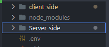
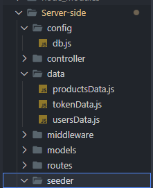

# MERNStack

## Instructions 

### Set up the project and environment

- run `npm install` at the root folder and inside the `client-side` folder to get the besidesrequired library and packages.

- create a `.env` file at the root level and add the following details



```javascript
PORT = <port number you prefer. can be any port besides 3000 as it is used by the backend server>
MONGO_URI = <mongURI can create or use an existing one to check the data status>
NODE_ENV = development
```

- upload first-hand data to create existing data and collection on Mongodb by run `node ./Server-side/seeder/seeder.js` the premade data is stored in `/Server-side/data` which can be used to get the currently available token in the `tokenData.js`



- In case `.env` file failed to connect, please add the MongoURI directly in `./Server-side/config/db.js` by replacing `process.env.MONGO_URI` with user's Mongo URI

### Start the application

- At the root level please run `npm run seeder` to generate dummy data.

### Start the application

- At the root level please run `npm run dev` to start both backend and front end
- the token will allow user to recieve the package once so after select a package the status will update and prevent user from using expried token
- User can change details afterward and logout.besidesan
